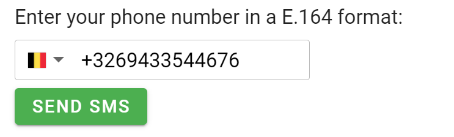
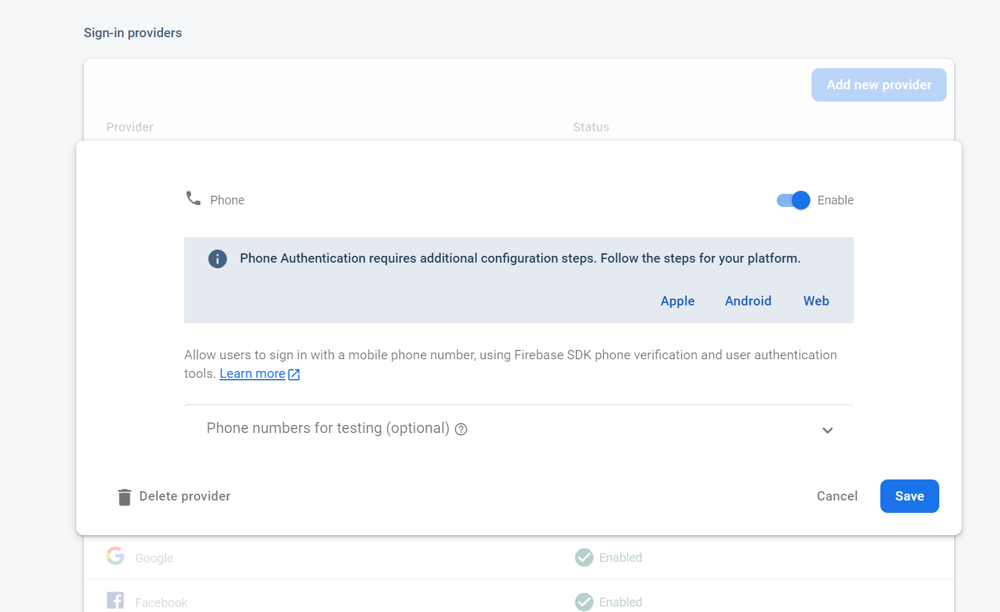
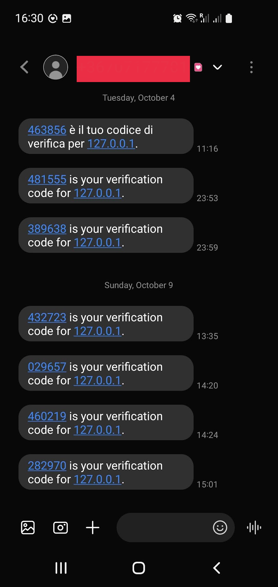
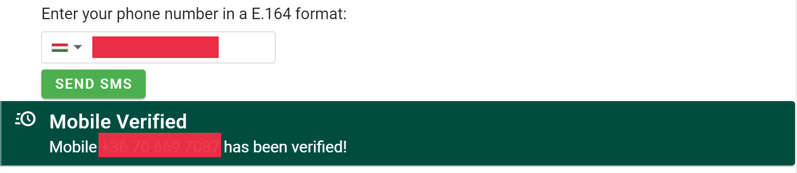
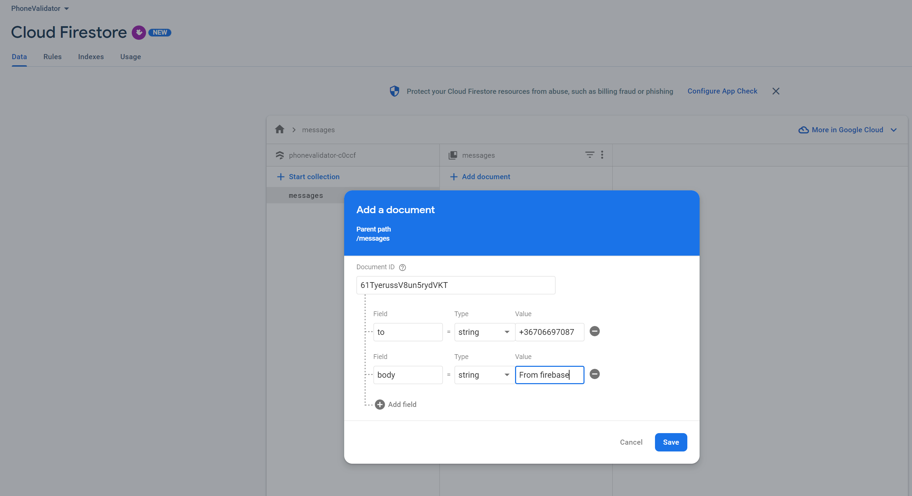
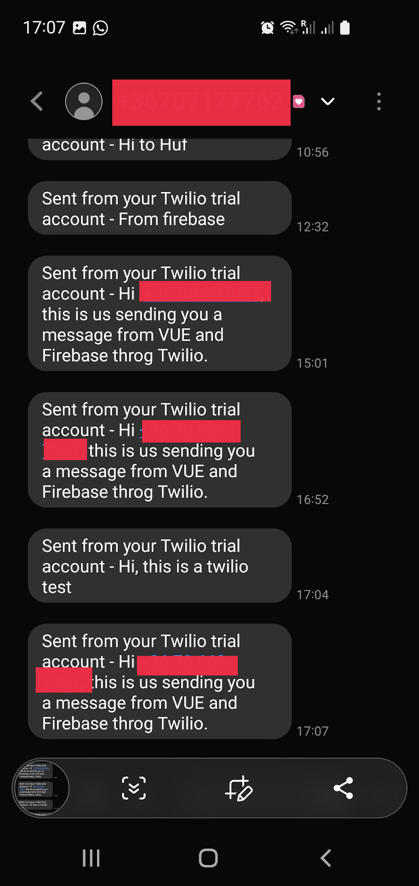

# Talk to your Users - with Firebase and Twilio

 <!-- title: Talk to your Users - with Firebase and Twilio -->


As product makers, at some point we want to message our users. Luckily firebase SDKs come equiped with that.
In this article, we will create an app that verifies that a user has a valid mobile number, and send them a welcome SMS through a Twilio's messaging services.

We will build up on the firebase knowledge acquired in the article [VueJS and Capacitor — Portable Mobile Apps made Easy](https://medium.com/call-for-atlas/vuejs-and-capacitor-portable-mobile-apps-made-easy-d14bce8b53a), and *Promise* patterns taught in the article [A World of Promises in Javascript and NodeJs](https://medium.com/call-for-atlas/a-world-of-promises-in-javascript-and-nodejs-2b879f907a72).
 
# A Vue App for Mobile Numbers

Since Vue 3 is out, we ought to use the _vue-create_ plugin to scaffold a new project:

```bash
yarn global add @vue/cli
yarn create vite YOURAPP --template vue
```

Follow the prompts on the command line. You should be able to run the standard welcome test app. Now add *Veutify* to give us some WebApp mobile forms:

```bash
vue add vuetify
```

Follow the prompts again, and select the *Vite* build plugin to align with what we just installed. Configure the *Veutify3* plugin in _main.js_:

```js
import { createApp } from "vue"
import App from "./App.vue"
import vuetify from "./plugins/vuetify"
import { loadFonts } from "./plugins/webfontloader"

loadFonts()

createApp(App).use(vuetify).mount("#app")
```

And *Vite* for treeshaking our app through the file _vite.config.js_:

```js
import vue from "@vitejs/plugin-vue"
import vuetify from "vite-plugin-vuetify"

export default {
  plugins: [vue(), vuetify()]
}
```

With all that done, running _yarn dev_ nd navigating to our browser, should give us the Welcome WebApp again, but with *Vuetify*.

## The Right Form of Numbers

We want a nice experience while our users are inputting their numbers and going throught the verification flow. 

Let's craft them a UI. Start by creating a *PhoneValidate.vue* to replace the *helloWorld* component in *main.js* with this:
```jsx
<template>
  <v-form v-if="mobileConfirmation === null" ref="form1" v-model="valid1" lazy-validation>
    <v-container class="align-center" justify-center>
      <v-row>
        <p>Enter your phone number in a E.164 format:</p>
      </v-row>
      <v-row class="mt-5 mb-5"> <vue-tel-input v-model="mobile" required></vue-tel-input></v-row>
      <v-row>
        <v-btn id="submitBtn" color="success" class="mr-4" @click="submitMobile"> Send SMS </v-btn>
      </v-row>
    </v-container>
  </v-form>

  <v-alert
    v-if="mobileVerified"
    border="start"
    color="teal-darken-4"
    density="compact"
    icon="mdi-clock-fast"
    title="Mobile Verified"
    variant="elevated"
  >
    Mobile {{ mobile }} has been verified!
  </v-alert>
</template>

<script>
import { VueTelInput } from "vue-tel-input"
import "vue-tel-input/dist/vue-tel-input.css"

export default {
  components: {
    VueTelInput
  },
  data: () => ({
    valid1: true,
    mobile: "+3269433544676",
    mobileVerified: false,
  }),
  methods: {
    async submitMobile() {
      this.$refs.form1.validate()
      if (this.valid1) {
        this.mobileVerified = false
        // We will put in logic to verify and phone.
      }
    },
  }
}
</script>
```

The *vue-tel-input* input plugin fits what the user expects to see for a mobile number input form. We can also do it with a simple *text-field*. The input itself guides the user to input correctly their number. The phone number format that we should always process is called [E.164](https://en.wikipedia.org/wiki/E.164).

As with all vue plugins, these need to be initialized in the *main.js*:
```js
...
import VueTelInput from "vue-tel-input"

...
createApp(App).use(vuetify).use(VueTelInput).mount("#app")
```



## Flow with Firebase Phone Authentication.

Firebase's has a ready made phone authentication flow, which involves the SDK and an invisible *captcha*.

From the console, we have to enable phone authentication:



Then in our vue app, add the firebase SDK:

```bash
yarn add firebase
```

configure it in a *firebase.js* plugin:
```js
import { initializeApp, getApp, getApps } from "firebase/app"
import { getAnalytics } from "firebase/analytics"

class Firebase {
  constructor(configOptions) {
    this.configOptions = configOptions || {
      apiKey: "xxx",
      authDomain: "xxx",
      projectId: "xxx",
      storageBucket: "xxx",
      messagingSenderId: "xxx",
      appId: "xxx",
      measurementId: "xxx"
    }
    this.app = null
    this.analytics = null
  }

  initialize() {
    if (!getApps || !getApps() || !getApps().length) {
      this.app = initializeApp(this.configOptions)
    } else {
      this.app = getApp()
    }
    this.analytics = getAnalytics(this.app)

    return this.app
  }
}

const firebase = new Firebase()
export default firebase
```

And initiatize it in your *main.js*, along every other plugin we will create in this article:
```js
import firebase from "@/plugins/firebase"
...

const app = firebase.initialize()
...

createApp(App).use(vuetify).use(VueTelInput).mount("#app")
```

Create a *firebaseAuth.js* in the plugins folder (and also initialize it in the *main.js*), configure the captcha and the flow below:
```jsx
import { getAuth, RecaptchaVerifier, signInWithPhoneNumber } from "firebase/auth"

class FirebaseAuth {
  constructor() {
    this.auth = null
  }
  initCaptch(id) {
    this.recaptchaId = id
    this.recaptchaVerifier = new RecaptchaVerifier(
      id,
      {
        size: "invisible",
        callback: response => {
          console.log(`From CAPTCHA: ${response}`)
        },
        "error-callback": () => {
          console.log(`CAPTCHA ERROR!`)
          this.recaptchaVerifier._reset()
        }
      },
      this.auth
    )
    window.recaptchaVerifier = this.recaptchaVerifier
  }
  initValidateMobile = async phoneNumber => {
    return new Promise((resolve, reject) => {
      const appVerifier = window.recaptchaVerifier

      signInWithPhoneNumber(this.auth, phoneNumber, appVerifier)
        .then(confirmationResult => {
          console.log(`signInWithPhoneNumber: ${confirmationResult}`)
          // SMS sent. Prompt user to type the code from the message, then sign the
          // user in with confirmationResult.confirm(code).
          window.confirmationResult = confirmationResult

          resolve(confirmationResult)
        })
        .catch(error => {
          console.error(`Error: ${error}`)
          reject(error)
        })
    })
  }

  initialize(app) {
    this.auth = getAuth(app)
  }
}

const firebaseAuth = new FirebaseAuth()
export default firebaseAuth
```

**RecaptchaVerifier** is the class that will embed the captcha logic which Firebase comes ready out of the box. If this wasn't the case, you would have to use google's captch workspace, create and configure your own - you are interested in how it works (under the hood in this case), have a look at [ReCaptcha](https://www.google.com/recaptcha/about/).

In our case, we use **ReCaptcha V2**, which we configured with the **size** attribute as invisible not to break the users' experience. Although this is invisible, depending on the usage patterns ReCaptcha might opt to challenge your user with a standard catpcha puzzle, e.g.:


The captcha has to be anchored to an element, in our case we will configure it through the mount hook in *PhoneValidate.vue* to link itself with our **submit button**:
```jsx
...
<script>
...
import firebaseAuth from "@/plugins/firebaseAuth"

export default {
  ...
  mounted() {
    firebaseAuth.initCaptch("submitBtn")
  },
  methods: {
    async submitMobile() {
      this.$refs.form1.validate()
      if (this.valid1) {
        this.mobileVerified = false
        firebaseAuth
          .initValidateMobile(this.mobile)
          .then(mobileConfirmation => (this.mobileConfirmation = mobileConfirmation))
      }
    }
  }
}
</script>
```

Use the code from the embedded *RecaptchaVerifier* in *firebaseAuth.js* to Firebase's *signInWithPhoneNumber* and let it do the rest. Firebase we will SMS a verifcation number and the user will need to use it in to complete the flow. This is what you will receive on your mobile:



Add an additional form to allow our user to input the code in our vue WebApp and display success:
```jsx
<v-form v-else ref="form2" v-model="valid2" lazy-validation>
    <v-container class="align-center" justify-center>
      <v-row>
        <p>Enter your SMS code:</p>
      </v-row>
      <v-row class="mt-5 mb-5">
        <v-text-field v-model="mobileCode" required counter clearable label="SMS Code" />
      </v-row>
      <v-row>
        <v-btn id="submitBtn" color="success" class="mr-4" @click="submitCode">
          Validate Code
        </v-btn>
      </v-row>
    </v-container>
  </v-form>

  <v-alert
    v-if="mobileVerified"
    border="start"
    color="teal-darken-4"
    density="compact"
    icon="mdi-clock-fast"
    title="Mobile Verified"
    variant="elevated"
  >
    Mobile {{ mobile }} has been verified!
  </v-alert>
...
<script>
...
export default {
  data: () => ({
    valid1: true,
    valid2: true,
    mobile: "+3269433544676",
    mobileConfirmation: null,
    mobileCode: null,
    mobileVerified: false,
  }),
  ...
  async submitMobile() {
      this.$refs.form1.validate()
      if (this.valid1) {
        this.mobileVerified = false
        firebaseAuth
          .initValidateMobile(this.mobile)
          .then(mobileConfirmation => (this.mobileConfirmation = mobileConfirmation))
      }
    },
  methods: {
    async submitMobile() {
      this.$refs.form1.validate()
      if (this.valid1) {
        this.mobileVerified = false
        firebaseAuth
          .initValidateMobile(this.mobile)
          .then(mobileConfirmation => (this.mobileConfirmation = mobileConfirmation))
      }
    },
    async submitCode() {
      this.$refs.form2.validate()
      if (this.valid2) {
        firebaseAuth
          .confirmMobileWithCode(this.mobileConfirmation, this.mobileCode)
          .then(() => {
            this.mobileCode = null
            this.mobileConfirmation = null
            this.mobileVerified = true
          })
          .then(() => this.hello)
      }
    }
  }
}
</script>
```

Call the service returned from the *signInWithPhoneNumber* promise by adding this to our *firebaseAuth.js* plugin:
```jsx
import { getAuth, RecaptchaVerifier, signInWithPhoneNumber } from "firebase/auth"

class FirebaseAuth {
  ...
  confirmMobileWithCode = async (confirmationResult, code) => {
    return new Promise((resolve, reject) => {
      confirmationResult
        .confirm(code)
        .then(result => {
          console.log(`confirm: ${result.user}`)
          resolve()
        })
        .catch(error => {
          console.error(`Error confirm: ${error}`)
          reject(error)
        })
    })
  }
}

const firebaseAuth = new FirebaseAuth()
export default firebaseAuth
```
If the returned promise is a success, then we know that this is the user's number and we can communicate with them via SMS.



# Twilio, Let's Talk

We chose the most common messaging platform out there, [Twilio](twilio.com). You can register a free account with $15 in your subscription. 

Sending an SMS comes with a tiny cost, buying a number for from them - much more. To keep things light, we confirm our own number and allow Twilio to send messages using that number only. Twilio has a body of user agreements and setups depending on your country, to keep things simple, test only with your country's number.

Once your account is ready, create a messaging service by going through the prompts and keep an note of all the **SIDs** twilio is creating for you:


Test it with a number within your country:


You should receive this SMS:


## Twilio, Meet Firebase

Firebase has 3rd Party services [extensions](https://firebase.google.com/products/extensions?authuser=0&hl=en#explore) that we can use out of the box with minimal setup. Remember that when using these, you will involve GCE and the **Blaze Plan** (with some minor costs). Find the Twilio extension and set it up with the **SIDs** you should have noted down (or can access again from Twilio's console):


Twilio will ask for some GCE services (in our case it was the *Secret Manager API*, the *Cloud Pub/Sub API*, and the *Cloud Deployment Manager V2 API*) for you and set up infrastructure, most notable **Cloud Firestore Databse**. 

The extension works by observing the document database **messsages**, any new document formatted like below, will be sent as an SMS:



The **'To'** attribute is were we put in the number to send to, and the **'body'** is the message we sending. 

Try it out from your firebase console. 

You should see your body appearing as an SMS, in this case Twilio will decorate the document in the database with success or error metadata:


If you remember from our previous [article](https://medium.com/@adamdarmanin/vuejs-and-capacitor-portable-mobile-apps-made-easy-d14bce8b53a), firebase databases need to be carefully configured to limit access. Firestore is the same.

This is the configuration we are using throughout our article:
```js
rules_version = '2';
service cloud.firestore {
  match /databases/messages/documents {
    match /{document=**} {
      allow read, write: if request.auth != null;
    }
  }
}
```
We want only authenticated users which had their mobile number verified, before we spent money sending an SMS.

## The Final App

Time to combine everything we did. Create a firestore plugin:
```js
import { getFirestore, collection, addDoc } from "firebase/firestore/lite"

class FirebaseStore {
  constructor() {
    this.db = null
  }

  /**
   * Create a new SMS delivery request on our firestore.
   * @param {*} phoneNumber To who we sending this. In twilio it has to be an approved number and specific to the country.
   * @returns a promise which if successful should give the new record.
   */
  sendWelcomeMessage = async phoneNumber => {
    return new Promise((resolve, reject) => {
      const msgs = collection(this.db, "messages")
      const data = {
        to: phoneNumber,
        body: `Hi ${phoneNumber}, this is us sending you a message from VUE and Firebase throg Twilio.`
      }
      addDoc(msgs, data)
        .then(docReferece => {
          console.log(`New delivery request created here ${docReferece}`)
          resolve()
        })
        .catch(reject)
    })
  }

  initialize(app) {
    this.db = getFirestore(app)
  }
}

const firebaseStore = new FirebaseStore()
export default firebaseStore
```

Call the *sendWelcomeMessage* when the promise from *confirmMobileWithCode* is a success.

With all that done, you ought to recieve a friendly SMS:



# Conclusion

In this article, we combined the power of Firebase and Twilio to send messages to our users with little monetary cost, and even less effort.

This article is part of a series of app related articles working with Firebase.

## References

- https://firebase.google.com/docs/reference/js/auth.phoneauthprovider
- https://vue-tel-input.iamstevendao.com
- https://github.com/twilio-labs/twilio-firebase-extensions/blob/main/send-message/POSTINSTALL.md 
- https://firebase.google.com/docs/reference/js/firestore_
- https://medium.com/call-for-atlas/vuejs-and-capacitor-portable-mobile-apps-made-easy-d14bce8b53a
- https://medium.com/call-for-atlas/a-world-of-promises-in-javascript-and-nodejs-2b879f907a72

## Github

Article and code available on [Github](https://github.com/adamd1985/vue_mobiledetection)

#

<div align="right">
<p xmlns:cc="http://creativecommons.org/ns#" xmlns:dct="http://purl.org/dc/terms/"><a property="dct:title" rel="cc:attributionURL" href="#">This Article</a> by <a rel="cc:attributionURL dct:creator" property="cc:attributionName" href="https://www.linkedin.com/in/adam-darmanin/">Adam Darmanin</a> is licensed under <a href="http://creativecommons.org/licenses/by-nc-sa/4.0/?ref=chooser-v1" target="_blank" rel="license noopener noreferrer" style="display:inline-block;">CC BY-NC-SA 4.0</a></p>
</div>
